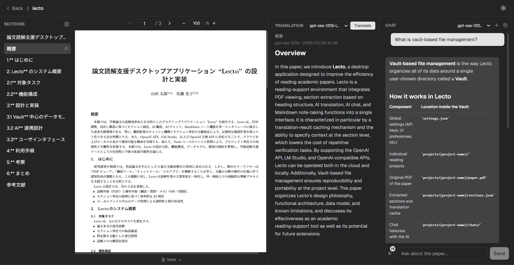

# Lecto

A desktop application for reading academic papers efficiently. Lecto integrates PDF viewing, automatic section extraction, AI translation, AI chat, and Markdown notes into a single interface.



---

## Features

- **PDF Viewer** — Continuous scroll, zoom, and text selection
- **Section Extraction** — Automatically extracts sections from PDF using heading structure (no AI required)
- **AI Translation** — Translates each section with streaming output and caches results
- **AI Chat** — Ask questions about the paper with selectable section context
- **Markdown Notes** — Per-project notes with syntax highlighting and preview mode
- **Multiple AI Providers** — Works with OpenAI, LM Studio (local), and any OpenAI-compatible API
- **Vault System** — Organize projects in a folder hierarchy with drag-and-drop
- **Dark / Light Mode**
- **Multilingual UI** — English, Japanese, Chinese

---

## Download

Pre-built binaries are available on the [Releases](../../releases) page.

| Platform | File |
|---|---|
| Windows | `Lecto-0.1.0-win.zip` |
| macOS | `Lecto-0.1.0-arm64.dmg` |
| Linux | `Lecto-0.1.0.AppImage` / `lecto_0.1.0_amd64.deb` |

No installation required for Windows and macOS — just extract and run.

---

## Getting Started

### 1. Launch the app and select a Vault

A **Vault** is any folder on your computer where Lecto stores your projects. You will be prompted to choose one on first launch.

### 2. Create a project

Click **New Project**, enter a name, and select a PDF file.

### 3. Configure AI settings

Go to **Settings** and add an AI preset with your API key, base URL, and model name.

| Provider | Base URL |
|---|---|
| OpenAI | `https://api.openai.com/v1` |
| LM Studio (local) | `http://localhost:1234/v1` |
| Other compatible APIs | any URL |

### 4. Open a project and start reading

- Click a section in the panel to load it into the translation area
- Press **Translate** to translate the section
- Use the **Chat** area to ask questions about the paper

---

## Data Storage

All data is stored as plain files inside your Vault:

```
{Vault}/
  settings.json          ← AI and language settings
  projects/
    {project-name}/
      paper.pdf
      sections.json      ← Extracted sections and cached translations
      chats/             ← Chat history
```

App-level settings (Vault path, theme) are stored in the OS user data directory:

| OS | Path |
|---|---|
| Windows | `%APPDATA%\Lecto\` |
| macOS | `~/Library/Application Support/Lecto/` |
| Linux | `~/.config/Lecto/` |

---

## Known Limitations

- Section extraction quality depends on the PDF structure. Scanned PDFs or unusual layouts may not extract correctly.
- Very large sections may hit the AI model's context limit during translation.

---

## For Developers

### Requirements

- Node.js 20+
- Python 3.10+ with `pymupdf4llm` and `onnxruntime==1.19.2`

### Setup

```bash
pip install pymupdf4llm onnxruntime==1.19.2 pyinstaller
npm install
npm run dev
```

### Build

```bash
# Windows (run on Windows)
pyinstaller --onedir scripts/extract_pdf.py -n extract_pdf --distpath resources `
  --collect-all pymupdf --collect-all pymupdf4llm `
  --exclude-module torch `
  --exclude-module torchvision `
  --exclude-module torchaudio `
  --exclude-module matplotlib `
  --exclude-module pandas `
  --exclude-module scipy `
  --exclude-module cv2
npm run dist

# macOS (run on macOS)
pyinstaller --onedir scripts/extract_pdf.py -n extract_pdf --distpath resources \
  --collect-all pymupdf --collect-all pymupdf4llm \
  --exclude-module torch \
  --exclude-module torchvision \
  --exclude-module torchaudio \
  --exclude-module matplotlib \
  --exclude-module pandas \
  --exclude-module scipy \
  --exclude-module cv2
npm run dist:mac

# Linux (run on Linux)
pyinstaller --onedir scripts/extract_pdf.py -n extract_pdf --distpath resources \
  --collect-all pymupdf --collect-all pymupdf4llm \
  --exclude-module torch \
  --exclude-module torchvision \
  --exclude-module torchaudio \
  --exclude-module matplotlib \
  --exclude-module pandas \
  --exclude-module scipy \
  --exclude-module cv2
npm run dist:linux
```

---

## License

This project is licensed under the [GNU Affero General Public License v3.0](LICENSE).

### Third-party licenses

This software includes the following AGPL-licensed components:

- [pymupdf4llm](https://github.com/pymupdf/RAG) — PDF to Markdown conversion (AGPL-3.0)
- [PyMuPDF](https://github.com/pymupdf/PyMuPDF) — PDF processing library (AGPL-3.0)
